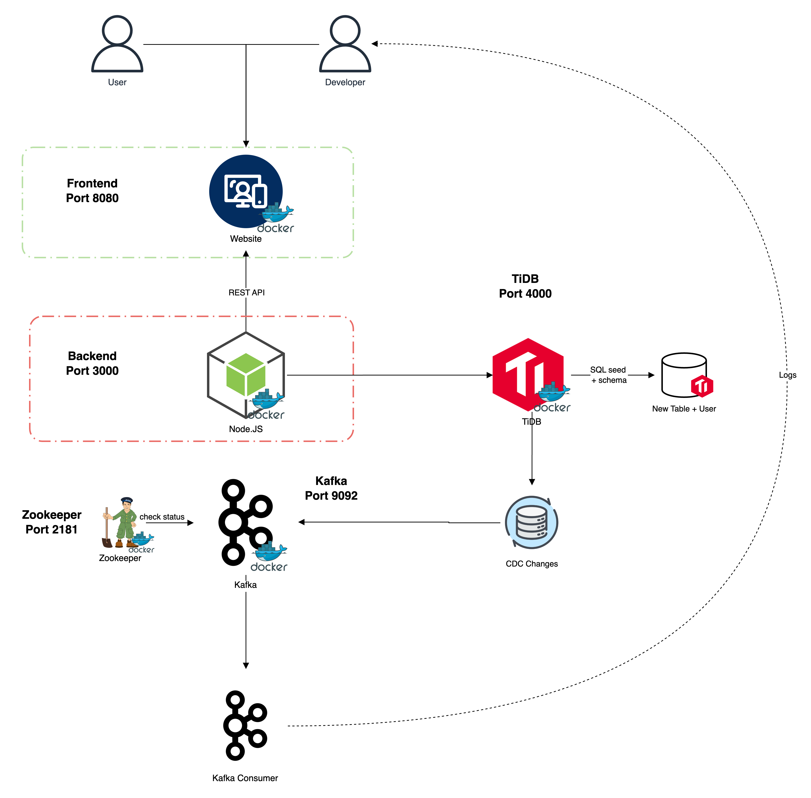

# Home Helfy task - Matvey Guralskiy

## Architecture


## Overview
This is a complete full-stack application with authentication, database integration, and monitoring capabilities built as part of a professional development test. The application demonstrates a modern microservices architecture with real-time data processing capabilities.

## Features

### Part 1: Simple Development ✅
- **Backend**: Node.js with Express.js
- **Frontend**: Basic HTML with vanilla JavaScript
- **API**: RESTful API with Node.js
- **Database**: TiDB integration
- **Authentication**: Login screen with username/password
- **Token Management**: User tokens stored in database and sent as HTTP headers

### Part 2: DevOps Implementation ✅
- **Dockerization**: Complete containerization of all services
- **Database**: TiDB running in Docker environment
- **Message Queue**: Apache Kafka integration
- **Auto-initialization**: Automatic database setup with default user

### Part 3: Monitoring & Logging (SRE Implementation) ✅
- **User Activity Logging**: JSON format logging with log4js
- **Database Change Monitoring**: Change Data Capture (CDC) with TiDB
- **Real-time Processing**: Kafka consumer application for database changes
- **Structured Logging**: Consistent logging format across all components

## Technology Stack
- **Frontend**: HTML + Vanilla JavaScript
- **Backend**: Node.js + Express.js
- **Database**: TiDB
- **Message Queue**: Apache Kafka
- **Containerization**: Docker & Docker Compose
- **Logging**: log4js
- **Authentication**: JWT-like token system

## Quick Start

### Prerequisites
- Docker
- Docker Compose
- Netcat (for health checks)

### Running the Project
**Simply run the start script:**
```bash
./start.sh
```

This single command will:
1. Start Zookeeper service
2. Start Kafka message broker
3. Start TiDB database
4. Initialize database with schema and default user
5. Start the backend API service
6. Start the frontend web application

### Access Points
- **Frontend**: http://localhost:8080
- **Backend API**: http://localhost:3000
- **TiDB Database**: localhost:4000
- **Kafka**: localhost:9092

## Default Credentials
- **Username**: admin
- **Password**: adminpass

## Project Structure
```
Git/
├── Backend/                # Node.js backend service
│   ├── server.js           # Main server with authentication API
│   ├── cdc-consumer.js     # Kafka consumer for database changes
│   ├── SQL/                # Database schema and seed files
│   └── Dockerfile          # Backend container configuration
├── Frontend/               # HTML frontend
│   ├── index.html          # Login page
│   ├── app.js              # Frontend JavaScript logic
│   └── Dockerfile          # Frontend container configuration
├── docker-compose.yml      # Multi-service orchestration
├── start.sh                # Single command startup script
├── .env                    # Store secrets
├── .gitignore              # To ignore env file
├── monitor-cdc.sh          # Script for CDC events
└── README.md               # README
```

## API Endpoints

### Authentication
- `POST /login` - User login with username/password
- `GET /protected` - Protected route requiring authentication token

### Headers
- `x-auth-token`: Include this header for authenticated requests

## Architecture Details

### Database Design
- **Users Table**: Stores user credentials and authentication tokens
- **Automatic Initialization**: Schema and seed data loaded on startup
- **Change Data Capture**: Real-time monitoring of database operations

### Message Queue Integration
- **Kafka Topics**: Database change events
- **Consumer Application**: Processes database changes in real-time
- **Structured Logging**: Consistent JSON format for all events

### Security Features
- **CORS Configuration**: Restricted to frontend origin
- **Token-based Authentication**: Secure API access
- **Input Validation**: Server-side validation of all inputs

## Monitoring & Observability

### Logging
- **User Actions**: Login attempts, authentication events
- **Database Changes**: All CRUD operations logged
- **System Events**: Service startup, health checks
- **Format**: Structured JSON with timestamp, user ID, action, and IP

### Health Checks
- **Service Dependencies**: Automatic waiting for dependent services
- **Port Verification**: Netcat-based health checks
- **Retry Logic**: Configurable retry attempts for service startup

## Development Notes

### Environment Variables
The application uses environment variables for configuration:
- Database connection details
- Admin user credentials
- Kafka broker configuration
- Service ports

### Docker Configuration
- **Multi-stage Builds**: Optimized container images
- **Health Checks**: Built-in service health monitoring
- **Service Dependencies**: Proper startup ordering
- **Port Mapping**: Exposed services for development access

## Troubleshooting

### Common Issues
1. **Port Conflicts**: Ensure ports 3000, 4000, 8080, 9092, 2181 are available
2. **Docker Permissions**: Run `chmod +x start.sh` if script execution fails
3. **Service Startup**: Check Docker logs if services fail to start

### Logs
- **Backend**: `docker-compose logs backend`
- **Frontend**: `docker-compose logs frontend`
- **Database**: `docker-compose logs tidb`
- **Kafka**: `docker-compose logs kafka`

## Testing the Application

1. **Start the application**: `./start.sh`
2. **Wait for all services to be ready** (script will indicate when ready)
3. **Open browser**: Navigate to http://localhost:8080
4. **Login**: Use default credentials (admin/adminpass)
5. **Check logs**: Monitor console for real-time activity logging

## Submission Requirements Met ✅

- [x] Complete source code in Git repository
- [x] Docker configuration files (docker-compose.yml, Dockerfiles)
- [x] Database schema and seed files
- [x] README.md with setup and running instructions
- [x] Single command execution (`./start.sh`)